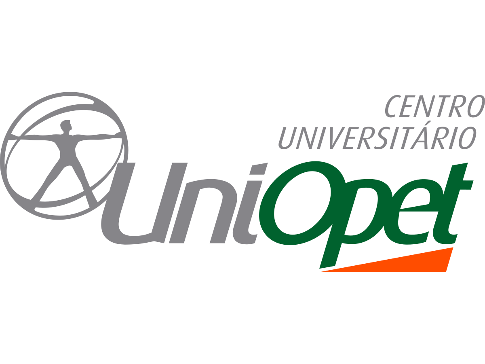

# Sistema de Validação Automática de Medidores – First-Off Landis+Gyr

<p align="center">
  
  &nbsp;&nbsp;&nbsp;&nbsp;&nbsp;&nbsp;
  
</p>

<h1 align="center">
Sistema de Validação Automática de Medidores
</h1>

<p align="center">
First-Off Landis+Gyr
</p>

<p align="center">
Projeto Integrador Extensionista • ADS • UniOpet
</p>

---

## Projeto Integrador Extensionista

Este projeto foi desenvolvido pelos alunos do curso de **Análise e Desenvolvimento de Sistemas** como atividade da disciplina de **Projeto Integrador Extensionista**, em parceria com a **Landis+Gyr**.

O objetivo do projeto é automatizar parte do processo de validação de medidores realizado durante a etapa de **First-Off**, reduzindo o tempo de conferência manual, aumentando a rastreabilidade das validações e diminuindo a possibilidade de erros humanos.

---

# Contexto

Atualmente, durante o processo de validação dos medidores, um operador precisa analisar manualmente diversos parâmetros para verificar se a configuração do equipamento está correta.

Esse processo exige atenção, tempo e está sujeito a falhas operacionais.

O sistema proposto busca automatizar essa validação através da leitura de arquivos XML e da comparação automática dos parâmetros encontrados com regras previamente definidas.

---

# Objetivo do Sistema

O sistema foi desenvolvido para:

- Importar arquivos XML de configuração;
- Ler automaticamente os parâmetros do medidor;
- Comparar os dados encontrados com os valores esperados;
- Identificar divergências;
- Classificar a validação como Confirmada ou Reprovada;
- Armazenar histórico de validações;
- Registrar o operador responsável;
- Gerar relatórios para consulta;
- Disponibilizar indicadores para acompanhamento das validações.

---

# Funcionalidades Implementadas

## Autenticação

- Login de usuários;
- Controle de acesso por perfil;
- Senhas protegidas com criptografia bcrypt.

### Perfis de Usuário

#### Operador

- Validar arquivos XML;
- Consultar histórico de validações.

#### Gestor

- Validar arquivos XML;
- Visualizar dashboard;
- Consultar histórico completo;
- Exportar relatórios CSV;
- Cadastrar novos usuários.

---

## Validação Automática

O sistema realiza automaticamente a comparação entre os parâmetros encontrados no XML e os parâmetros esperados.

Quando todos os parâmetros estão corretos:

**CONFIRMADO**

Quando existe alguma divergência:

**REPROVADO**

As divergências identificadas são registradas e apresentadas ao usuário.

---

## Dashboard

O dashboard apresenta indicadores como:

- Total de validações realizadas;
- Validações confirmadas;
- Validações reprovadas;
- Validações pendentes;
- Quantidade de validações por operador.

---

## Histórico

O sistema mantém um histórico completo contendo:

- Operador responsável;
- Data da validação;
- Modelo do medidor;
- Tipo do medidor;
- Status da validação.

---

## Relatórios

Permite exportação do histórico em formato CSV para consulta e análise posterior.

---

# Tecnologias Utilizadas

### Linguagem

- Python

### Banco de Dados

- SQLite

### Segurança

- bcrypt

### Manipulação de XML

- xml.etree.ElementTree

### Exportação

- CSV

---

# Arquitetura do Projeto

```text
backend/
│
├── app.py
│
├── database/
│   ├── database.py
│   ├── user_repository.py
│   └── validation_repository.py
│
├── services/
│   ├── auth_service.py
│   ├── validator.py
│   └── xml_reader.py
│
├── reports/
│   └── csv_exporter.py
│
├── rules/
│   └── validation_rules.py
│
├── utils/
│   └── password.py
│
├── samples/
│
└── first_off.db
```

---

# Resultados Obtidos

O sistema desenvolvido permite automatizar a validação de configurações dos medidores através da leitura de arquivos XML e da aplicação de regras de negócio previamente definidas.

A solução proporciona:

- Redução do trabalho manual;
- Padronização das validações;
- Maior rastreabilidade;
- Registro histórico das operações;
- Controle de usuários e permissões;
- Apoio à tomada de decisão através de indicadores.

---

# Equipe de Desenvolvimento

Projeto desenvolvido pelos alunos:

- Bruna Candido
- Evelyn Amaral
- Naftali Ferrari

Curso de Análise e Desenvolvimento de Sistemas

---

# Empresa Parceira

**Landis+Gyr**

---

# Instituição de Ensino

**Centro Universitário UniOpet**

---

# Observação

Este projeto possui caráter acadêmico e foi desenvolvido exclusivamente para fins educacionais dentro da disciplina de Projeto Integrador Extensionista.